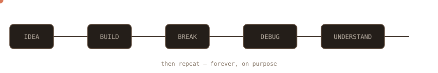
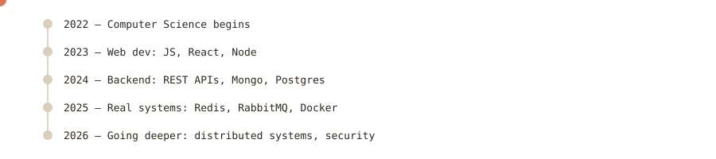
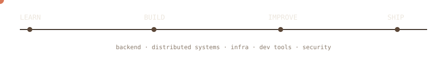

<!-- ═══════════════════════════════════════════════════════════ -->
<!--  aryan@claude-code — session transcript                     -->
<!--  Claude's own cream/rust palette — every asset self-hosted  -->
<!-- ═══════════════════════════════════════════════════════════ -->

<div align="center">

<!--  -->


<a href="https://github.com/Aryan681"></a>
<a href="https://www.linkedin.com/in/aryansingh1-2-/"></a>
<a href="mailto:Aryannaruka7@gmail.com"></a>

</div>


<div align="center">

</div>

> **I don't just want to make things work.**
> **I want to understand why they work — and what happens when they don't.**


<div align="center">

</div>


<p align="center">

**Languages**
<br/>

**Backend**
<br/>

**Data & Messaging**
<br/>

**Infrastructure**
<br/>

**Frontend**
<br/>

**Tools**
<br/>

</p>


<div align="center">

</div>


```text
┌─────────────────────────────────────────────────────────────┐
│   ⚙️  Backend Architecture      📨  Message Queues          │
│   🗄️  Database Design          🔐  Authentication & Security │
│   ⚡  Performance & Caching     ☁️  Infrastructure           │
│   🌐  Distributed Systems       🧠  System Design            │
└─────────────────────────────────────────────────────────────┘
```


```text
🎮 Gaming     📚 Reading      🏆 Hackathons
🧩 DSA        🎧 Music        👥 LAN / Team Events
```

I'm also a former **NCC cadet**, which taught me a lot about discipline,
teamwork and responsibility outside of software.


<div align="center">

</div>


```bash
$ ./random_facts.sh

> favorite debugging technique:
  stare at the code until it becomes someone else's bug.

> current obsession:
  "how does this actually work under the hood?"

> weakness:
  optimizing something that already worked.

> superpower:
  refusing to leave a bug unexplained.

> preferred environment:
  terminal + headphones + questionable amount of coffee.

> status:
  ● BUILDING
```


<p align="center">
  
  
</p>


<p align="center">
  
</p>

<!-- snake — generated by .github/workflows/snake.yml, left exactly as-is -->
<p align="center">
  
</p>


<div align="center">

</div>

**Backend Engineering · Distributed Systems · Infrastructure · Developer Tools · Security**


<p align="center">
<a href="https://www.linkedin.com/in/aryansingh1-2-/"></a>
<a href="https://x.com/Aryan_Naruka"></a>
<a href="mailto:Aryannaruka7@gmail.com"></a>
</p>

<div align="center">

<sub>Thanks for stopping by. ⭐</sub>

</div>


