<div align="center">



<br/>

<a href="https://github.com/Aryan681"></a>
<a href="https://www.linkedin.com/in/aryansingh1-2-/"></a>
<a href="mailto:Aryannaruka7@gmail.com"></a>

</div>

<br/>

### ⏺ Read(who-is-this.md)

I'm **Aryan Singh** — a backend engineer who got into software through the frontend and
never looked back once I saw what was happening behind the API. B.Tech CSE at NIMS
University, Jaipur, class of 2026.

I care about the part of the system nobody sees until it breaks: the queue that backs up
at 2am, the cache that goes stale silently, the worker that dies without telling anyone.
Most of my actual learning has come from being the person who had to find out why.

### ⏺ Read(current-focus.md)

```
building   → real-time calling / social backend — Node.js, Socket.io, Redis
learning   → distributed systems: Docker, Kubernetes, system design
exploring  → auth patterns, message queues, and infra at scale
```

### ⏺ Read(stack.md)

`Node.js` `Express` `PostgreSQL` `MongoDB` `Redis` `RabbitMQ` `Socket.io` `Firebase FCM` `AWS S3`
`Docker` `Kubernetes` `React` `Next.js` `Java` `C++` `Python`

### ⏺ Bash(cat contributions.log)

<div align="center">
 
</div>


> Auto-regenerates daily via `.github/workflows/snake.yml` — it's pulling your real
> contribution graph and re-drawing it in the same rust/charcoal palette as the banner
> above, so this section stays alive on its own.

### ⏺ Bash(cat milestones.log)

```
[WINNER]     miniMide Hackathon — Best Healthcare Innovation
[FINALIST]   Level SuperMind Hackathon
[BACKGROUND] Former NCC Cadet
```

### ⏺ Task(open-to)

```
backend engineering roles · distributed systems · infra · dev tools · security
open to hackathons, OSS, and systems-heavy side projects
```

<div align="center">

<a href="https://www.linkedin.com/in/aryansingh1-2-/"></a>
<a href="https://x.com/Aryan_Naruka"></a>
<a href="mailto:Aryannaruka7@gmail.com"></a>

</div>
